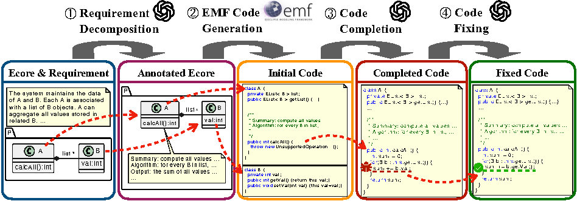
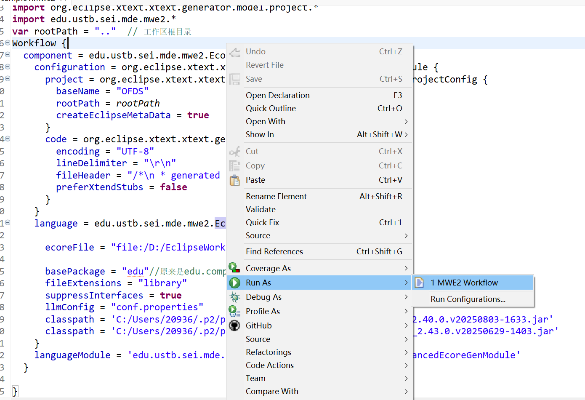

# iEcoreGen
A Hybrid Approach for EMF Code Generation: Code Templates Meet Large Language Models

# Introduction

**iEcoreGen** is a LLM-enhanced model-driven code generation project. It combines conventional MDE code generation with LLM-based code generation.

MDE allows to generate correct code from a model. However, MDE fails when the model cannot express our intention. In contrast, LLM-based code generation can always give a response, even though its answer may be incorrect.

The basic idea of iEcoreGen is to combine MDE and LLM. Given an Ecore model, we ask EMF to generate source code from the model, while leaving unspecified operations to LLMs.

We hope that such a combination can allow us to benefit from both MDE and LLM.

# Approach



The input is an ecore model, optionally with a system requirement.

The system requirement can be provided in this way:
 **Embedded in the Ecore model**: Using an EAnnotation (typically named "EnhancedCodeGen") with a Details Entry containing the functional requirements (equivalent to FR.md content)

Our tool will read the ecore model and check if there is a requirement. If not, our tool will ask LLMs to synthesize a requirement according to the model.

Then, we ask LLMs to write a specification for every operation. An operation specification includes a summary of functionality, an algorithm, input and output values, and pre-/post-conditions.

We will extract the specifications returned and store them as operation documents in the model.

After that, EMF code generator will be invoked to generate Java code from the ecore model.

Note that operations defined in the model are still unimplemented and the specifications will be generated as docstrings.

We further send Java code generated by EMF to LLMs and ask them to complete unimplemented operations based on their docstrings.

Due to token limit, we must minimize the Java code sent to LLMs by hiding details of Java methods and fields that are not intended to be completed by LLMs.

We also provide necessary context, such as related classes and their methods, to facilitate code generation.

At last, we merge the code returned by LLMs into the EMF generated code to complete the entire generation process.

# Repository Structure

```
iEcoreGen/
├── benchmarks/              # Evaluation datasets with 20 domain models
│   ├── AcademicProgram/
│   ├── AirlineFlights/
│   ├── BankSystem/
│   ├── Cinemas/
│   └── ...
│       ├── *.ecore         # Ecore model files
│       ├── DD.md           # Domain Description
│       ├── FR.md           # Functional Requirements
│       ├── DeM.md          # Design Model·
│       └── TS.md           # Test Specifications
├── raw_data/               # Experimental results
│   ├── RQ1/               # Baseline comparison experiments
│   └── RQ2/               # Ablation study results
├── sourceCode/
│   ├── baseline/          # Baseline implementations
│   └── iecoregen/         # iEcoreGen implementation
└── README.md
```

# Benchmarks

The `benchmarks/` directory contains 20 real-world domain models for evaluation, including:
- Academic Program Management
- Airline Flight Systems
- Banking Systems
- Cinema Management
- Company Warehouses
- Employee Management Systems
- File Management
- Football Team Management
- And more...

Each benchmark provides comprehensive documentation:
- **Ecore Model**: Domain model definition (may include an EAnnotation with embedded functional requirements in a Details Entry)
- **DD.md**: Domain description and context
- **FR.md**: Functional requirements specification (can also be embedded in the Ecore model's EAnnotation)
- **DeM.md**: Design model
- **TS.md**: Test specifications

**Note**: The Ecore models can embed functional requirements directly using an EAnnotation (e.g., "EnhancedCodeGen") with a Details Entry. This allows the requirements to be stored within the model itself, making it self-contained and eliminating the need for separate FR.md files.

# Experimental Evaluation

## RQ1: Comparison with Baselines

We compare iEcoreGen against three baseline approaches:

- **Base-R**: LLM generates code from domain requirements only
- **Base-R+CD**: LLM generates code from domain requirements + functional descriptions + class diagrams
- **Base-R+CD+Fix**: Base-R+CD with error fixing capability (if generated code has errors, fix them)

**iEcoreGen**: Uses Ecore models with requirement decomposition and context-compressed fix (if generated code has errors, compress context to relevant classes and methods for fixing)

## RQ2: Ablation Study

Evaluates the contribution of individual components in iEcoreGen.

Experimental results are available in `raw_data/RQ1/` and `raw_data/RQ2/`.

# Workflow

iEcoreGen uses MWE2 to automate the entire workflow. Users need to create a MWE file to enable the generation. A simple MWE file looks like below.

```
module iecoregen.sample

import org.eclipse.xtext.xtext.generator.*
import org.eclipse.xtext.xtext.generator.model.project.*
import edu.ustb.sei.mde.mwe2.*

var rootPath = ".."

Workflow {
    component = EcoreGenerator {
        configuration = {
            project = StandardProjectConfig {
                baseName = "<project name>"
                rootPath = rootPath
                createEclipseMetaData = true
            }
            code = {
                encoding = "UTF-8"
                lineDelimiter = "\r\n"
                fileHeader = "/*\n * generated by Enhanced EcoreGen\n */"
                preferXtendStubs = false
            }
        }
        language = EcoreLanguage {
            ecoreFile = "<path to ecore model>"
            basePackage = "<a base package name, e.g., edu.ustb.sei.mde>"
            fileExtensions = "<EMF extension, usually the name of the EPackage>"
            suppressInterfaces = true
            llmConfig = '<your path>/conf.properties'
        }
        languageModule = 'edu.ustb.sei.mde.eecg.llm.languageModule.DefaultEnhancedEcoreGenModule'
    }
}
```

The workflow will read a properties file to load the parameters of LLMs. The properties file looks like below.

```properties
apikey=<your api key>
url=https://api.deepseek.com/
model=<your model name>
```
# Quick Start

## Prerequisites

Before using iEcoreGen, ensure you have the following environment configured:

1. **Eclipse IDE** with the following plugins:
   - Xtext
   - MWE2 (Modeling Workflow Engine 2)
   - EMF (Eclipse Modeling Framework)

2. **Required Dependencies**:
   - `edu.ustb.sei.ai`
   - `edu.ustb.sei.ai.spring.port`
   - `edu.ustb.sei.mde.eecg`
   - `edu.ustb.sei.mde.mwe2`

## Steps to Run

1. **Create an Ecore Model**
   
   Create a new `.ecore` file that accurately reflects your system design. This model should define your domain entities, attributes, and relationships.

2. **Configure MWE2 Workflow**
   
   Set up your MWE2 workflow file (`.mwe2`) with the appropriate generation parameters and paths.

3. **Execute the Workflow**
   
   Run the configured MWE2 workflow to generate your code artifacts.

> **Tip**: You can refer to the example benchmarks in the `benchmarks/` folder to see sample Ecore models and their corresponding specifications.

## Sample

The following screenshot demonstrates the tool in action, showing the MWE2 workflow configuration file being executed in Eclipse IDE. You can see the code generation process running with the "1 MWE2 Workflow" configuration, which processes the Ecore model and generates the corresponding source code files.




